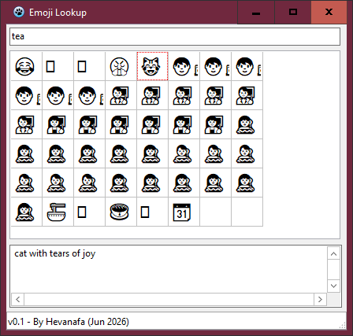

# Emoji Lookup

An app to look up emojis, written in Free Pascal (Lazarus)

## Building

1. Open `project.lpi` with Lazarus IDE (v4.6 is used during development)
2. Change the build mode to **release**
3. **Run > Compile** (`Ctrl+F9`)

## Emoji Data

This application uses emoji data derived from the Unicode Consortium's
`emoji-test.txt` file.

Unicode data © Unicode, Inc.
Used under the Unicode License.

https://www.unicode.org/license.html
